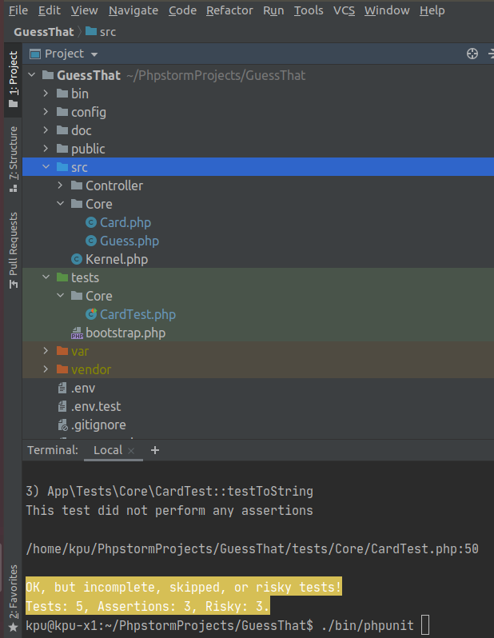

# Guess What

Prise en main de la POO avec PHP

Niveau : Deuxième année de BTS SIO SLAM

Prérequis : bases de la programmation, PHP 7 ou supérieur installé sur votre machine de dev.  

## Thème 

Développer une logique de jeu puis l'adapter progressivement (en _refactoring_) à un contexte d'application web (avec symfony)   
 
Les étapes d'un scénario typique d'usage sont 

1. (optionnel) paramétrage du jeu (par exemple choix du jeu de cartes, aide à la recherche, ...)
2. Lancement d'une partie (le jeu tire une carte "au hasard"), que le joueur doit deviner en un temps "optimal"
3. Le joueur propose une carte  
4. Si c'est la bonne carte alors la partie se termine et le jeu affiche des éléments d'analyse (nombre de fois
 où le joueur a soumis une carte, sa qualité stratégique, ...)
* Si ce n'est pas la bonne carte, alors si l'aide est activée, le joeur est informé si la carte qu'il a soumise est 
plus petite ou plus grande que celle à deviner. Retour en 3.

## Objectif

* Mise au point de la logique applicative avec PHPUnit
* Notion de structure de données, recherche d'un élement dans une liste 
* Analyse des actions du joueur (fonction du nombre de cartes, aides à la décision)  

## Premiers éléments d'analyse 


Cette analyse est une première ébauche, donc incomplète et/ou à ajuster, mais suffisante pour réaliser 
vos premiers pas sur ce projet.

Pour l'essentiel (le cours associé apportera d'autres informations et répondra à vos questions) : 
* La classe `Guess` est responsable de la logique du jeu.
* La classe `Card` définit la structure d'une carte à jouer. 

Une instance de `Guess` est relièe, à un instant _t_, à un ensemble de cartes
 (`cards`) et à une instance de `Card` (`selectedCard` est la carte que le joueur doit deviner)   

## Première implémentation

Classe `Card` (extrait. Localisation : `src/Core/Card.php`)
```php
<?php
namespace App\Core;

/**
 * Class Card : Définition d'une carte à jouer
 * @package App\Core
 */
class Card
{
  /**
   * @var $name string nom de la carte, comme par exemples 'As' '2' 'Reine'
   */
  private $name;

  /**
   * @var $color string couleur de la carte, par exemples 'Pique', 'Carreau'
   */
  private $color;

  /**
   * @return string
   */
  public function getName(): string
  {
    return $this->name;
  }

  // [...]
}
```


Classe `Guess` (extrait. Localisation : `src/Core/Guess.php`)

```php
<?php

namespace App\Core;

/**
 * Class Guess : la logique du jeu.
 * @package App\Core
 */
class Guess
{
  /**
   * @var $cards array a array of Cards
   */
  private $cards;

  /**
   * @var $selectedCard Card This is the card to be guessed by the player
   */
  private $selectedCard;

}

```

## TP1 de prise en main

### Vérifier les prérequis de votre système

* `php cli`  doit être opérationnel. (en ligne de commande tester : `php -version`)
* `composer` doit être opérationnel. (en ligne de commande tester : `composer -V`)

### Télécharger le projet de démarrage

:point_right: _Conseil : utiliser l'instruction `git clone`_

Une fois cloné, **aller à la racine du projet** puis lancer les commandes suivantes :
* `composer install`  (le téléchargement et installation des composants déclarés dans le fichier `composer.json` peut prendre quelques minutes)

* `./bin/phpunit --version` (le résultat devrait être, à un numéro de version prêt : `PHPUnit 7.5.20 by Sebastian Bergmann and contributors.` )

:point_right: À ce niveau là, ne vous préoccupez pas de l'écosystème Symfony, il serait étudié très bientôt.

### Tester le bon fonctionnement de ce petit existant

#### Lancement des tests unitaires
  
À **la racine du projet** du projet, lancer la commande :  `./bin/phpunit`

Le résultat attendu est : 

    kpu@kpu-x1:~/PhpstormProjects/GuessThat$ ./bin/phpunit 
    PHPUnit 7.5.20 by Sebastian Bergmann and contributors.

    Testing Project Test Suite
    ..RRR                                                               5 / 5 (100%)

    Time: 51 ms, Memory: 6.00 MB

    There were 3 risky tests: This test did not perform any assertions

    1) App\Tests\Core\CardTest::testColor
    2) App\Tests\Core\CardTest::testCmp
    3) App\Tests\Core\CardTest::testToString

    OK, but incomplete, skipped, or risky tests!
    Tests: 5, Assertions: 3, Risky: 3.

Ressources utiles :

* **Fortement recommandé (à étudier chez vous) :** [Les tests unitaires, premiers pas avec PHPUnit sur openclassrooms](https://openclassrooms.com/fr/courses/4087056-testez-et-suivez-letat-de-votre-application-php/4419446-premiers-pas-avec-phpunit-et-les-tests-unitaires) - n'hésitez pas à noter vos questions, j'y répondrai en cours. 
* [Documentation de PHPUnit en français](https://phpunit.readthedocs.io/fr/latest/)

## TP2 implémentation des TODOs 

Bravo, si vous en êtes là, c'est que votre machine de dev est opérationnelle pour ce projet.
Vous allez maintenant avoir besoin d'un éditeur de code source qui vous permette de passer en mode projet.

:point_right: _une erreur de débutant consiste à ouvrir un fichier à partir de l'explorateur de fichier._ 
 
Par la suite nous utiliserons **PHPStorm** (un IDE très puissant en terme de conseils et de génération automatique 
de code).
 
Ouvrir le projet via `File | Open`, puis sélectionner le **dossier racine** de votre application.

Dans la fenêtre `Termnal` en bas, vous devriez pouvoir lancer la commande `./bin/phpunit` et obtenir ceci :  


 
Le message `Tests: 5, Assertions: 3, Risky: 3.` nous informe que 5 tests ont été lancés, avec 3 assertions au total, 
mais 3 tests sont à risque pour la bonne raison qu'ils ne testent rien ! **Ceci est votre premier challenge !**

Le travail à faire a été signalé dans le code source par des commentaires `TODO` (une pratique courante dans le métier).

Pour consulter la liste des TODOs, ouvrir la fenêtre TODO tool: `View | Tool Windows | TODO`.
 
:point_right: Attention : la méthode toString fait partie des méthodes dites _magique_ en PHP. À ce sujet vous consulterez 
cette documentation [methode magique toString](https://www.php.net/manual/fr/language.oop5.magic.php#object.tostring)
 
## TP3 conception de tests unitaires pour `Guess`

À ce niveau là, vous avez acquis une certaine autonomie sur le projet et intégré les
concepts de base de la notion de tests unitaires. C'est ce que nous allons vérifier.

Votre mission consiste à concevoir une classe de tests qui teste la logique du jeu (représentée par la classe `Guess`).
Ce travail est à réaliser en binôme. Il y aura des décisions à prendre, qui pourront être discuter collectivement, 
entre différents binômes.

Voici quelques éléments à prendre en compte dans votre analyse.

* Recherche linéaire (dite aussi séquentielle) : L'utilisateur explore une à une les cartes afin de trouver la bonne. 
Dans le pire cas il soumettra autant de cartes que le jeu en contient (l'ordre de grandeur est O(n), _n_ étant 
le nombre de cartes), dans le meilleur cas O(1) (coup de chance il tombe dessus du premier coup).  
* Recherche dichotomique (nécessite une relation d'ordre total) : Si l'utilisateur est informé de la position de 
la carte qu'il soumet par rapport à la carte à trouver (inférieur ou supérieur) alors il peut appliquer une 
stratégie qui réduit le nombre de cas à soumettre dans le pire cas, de l'ordre de O(log2 n). 

L'analyse de la stratégie du joueur, lorsqu'il termine une partie, devra prendre en compte les paramètres du jeu, 
à savoir le nombre de cartes et l'aide à la décision si elle a été activée pour la partie en question. 

:point_right: À ce niveau là, il n'est pas question d'interagir avec un utilisateur (ce sera vu ultérieurement). 
Tout se passe donc dans les classes de tests !

Bonne analyse et programmation !
